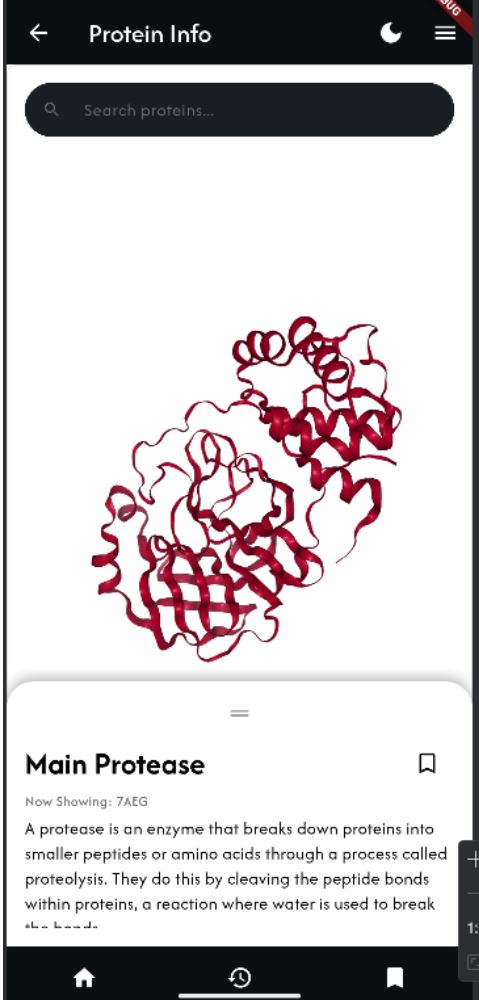
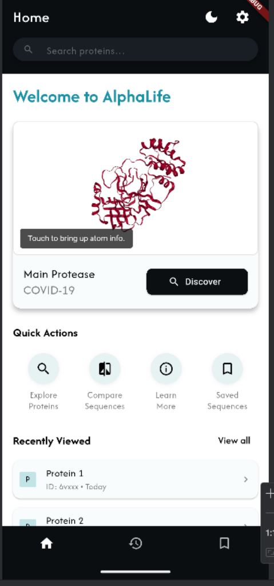
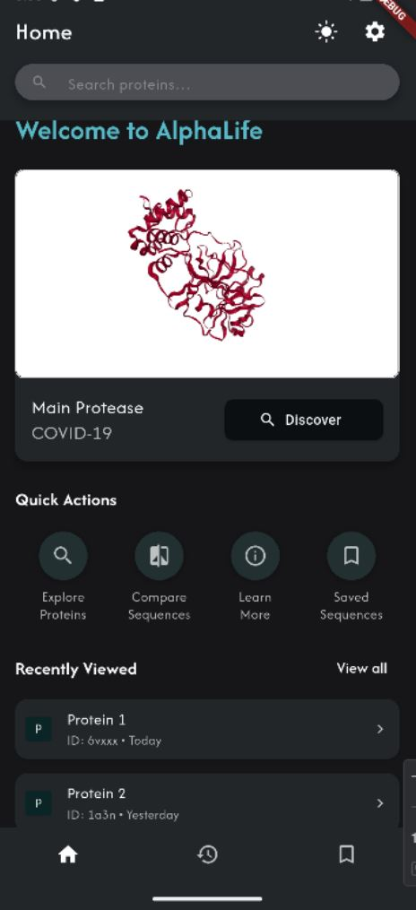

# AlphaLife: Interactive Protein Visualization Mobile App

**AlphaLife** is anandroid mobile application built with Flutter that visualizes 3D protein folding structures. Developed as a final year project, the app is designed to serve both **educational** and **research** purposes—allowing students and professionals to explore and interact with complex protein structures in an intuitive and accessible way.

## 📱 Overview

The app integrates real-time 3D model rendering of protein structures (using PDB codes) through a WebView-based viewer. Its lightweight architecture ensures compatibility with mid-range Android devices while supporting future scalability via Firebase backend integration.

Key Use Cases:
- Undergraduate bioscience students enhancing lab reports with molecular structure visualizations
- Educators demonstrating protein folding principles in classrooms
- Researchers referencing structural metadata via embedded PDB access

## 🔍 Features

- 🔬 **3D Protein Visualization**  
  WebView-based rendering using [NGLViewer](https://nglviewer.org/), powered by `webview_flutter` and `molecule_viewer` packages.

- 📚 **Educational Metadata Support**  
  Slide-up panels provide basic annotations and direct links to official PDB publications.

- 🧭 **User Interface & Experience**  
  - Dropdown menu for selecting curated protein sequences  
  - Interactive touch gestures: zoom, rotate, pan  
  - Dark mode support  
  - Quick actions, bookmarks, and recent history tracking  
  - Onboarding and user guidance pages

- 🛠 **Modular Codebase**  
  Designed for easy maintenance and feature expansion using Flutter’s widget architecture.

- 🔐 **Future Features (In Progress)**  
  - Firebase authentication (login/signup)  
  - Cloud-hosted protein dataset integration  
  - Export/share model view snapshots

## 🧪 Technologies Used

| Category         | Tools / Frameworks                                  |
|------------------|------------------------------------------------------|
| Frontend         | Flutter (Dart), Figma for UI design                  |
| Visualization    | NGLViewer via WebView (`webview_flutter`)            |
| Backend (Planned)| Firebase (Firestore, Auth)                          |
| Version Control  | Git & GitHub                                         |
| Testing          | White-box, Black-box with user feedback integration  |

---
⚠️ Note: Full Firebase integration is not deployed. Current version runs using local JSON files for protein data.

### Requirements
- Flutter SDK 3.13.0+
- Dart SDK 3.1.0+
- Android Studio or VSCode with Flutter plugin
- Android device or emulator (API 21+)

### Run the App
```bash
git clone https://github.com/yourusername/alphalife.git
cd alphalife
flutter pub get
flutter run
```

## 🧠 Lessons Learned
Through this project, we explored the complexities of real-time 3D visualization on mobile, adapted to mid-project changes like the open-source release of AlphaFold 3, and improved collaboration under Agile sprints. Significant effort went into balancing performance with usability for our target educational audience.

🤝 Acknowledgements

- AlphaFold by DeepMind
- RCSB Protein Data Bank
- NGL Viewer
- Our project supervisor Prof Raphaël Phan at Monash University Malaysia

🙋 Team
- Khadija [https://github.com/kj002]
- Roshena [https://github.com/rosh-03]
- Nisha [https://github.com/rys-9]


---

Let me know if you'd like a Korean version, or if you want to include badges (build status, license, etc.) or screenshots/gifs of the app in use!
<p float="left">
  
  
  
</p>


